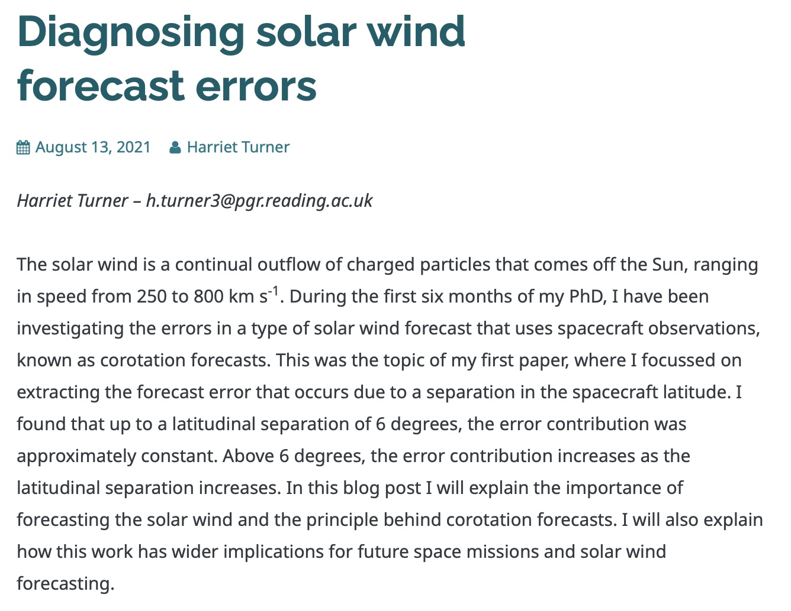

This blog post was for my departments PhD student blog and the post looked at the work for my paper published in 2021. 

The work was focussed around the forecast errors present in solar wind corotation forecasts, with the aim of this informing the solar wind data assimilation scheme used later in my PhD. The blog post can be found [here](https://socialmetwork.blog/2021/08/13/diagnosing-solar-wind-forecast-errors/). 

