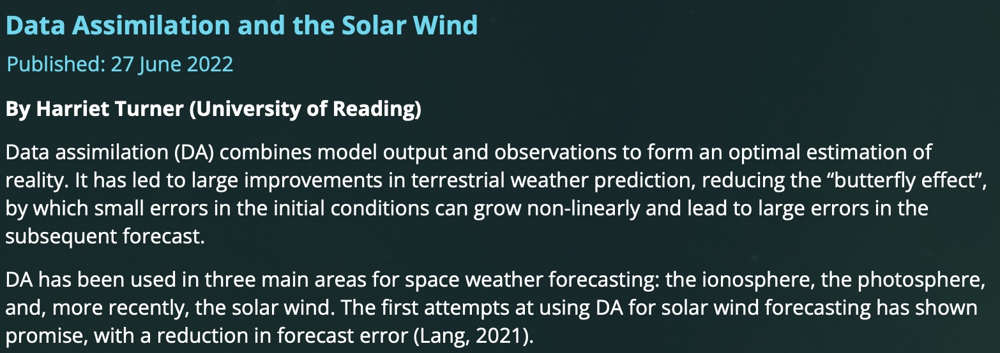

I wrote a short article for the Magnetosphere, Ionosphere and Solar-Terrestrial (MIST) groups 'nugget' page, briefly explaining the premise behind the solar wind data assimilation scheme. 

The article can be found [here](https://www.mist.ac.uk/nuggets/312-data-assimilation-and-the-solar-wind). 

