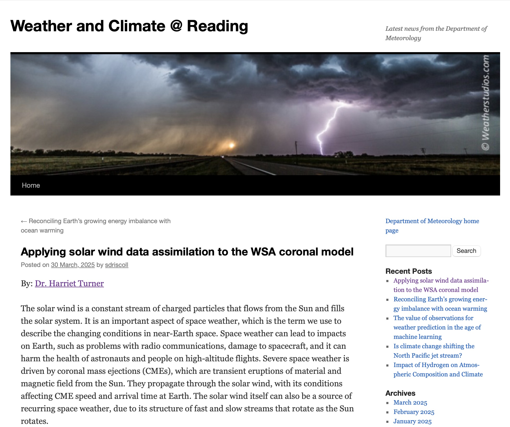

I wrote a blog post for the University of Reading's Departmental of Meteorology blog. 

I was approached to write a post for the departments page, which highlights the latest news and research within the department. The post can be found [here](https://blogs.reading.ac.uk/weather-and-climate-at-reading/2025/applying-solar-wind-data-assimilation-to-the-wsa-coronal-model/).

