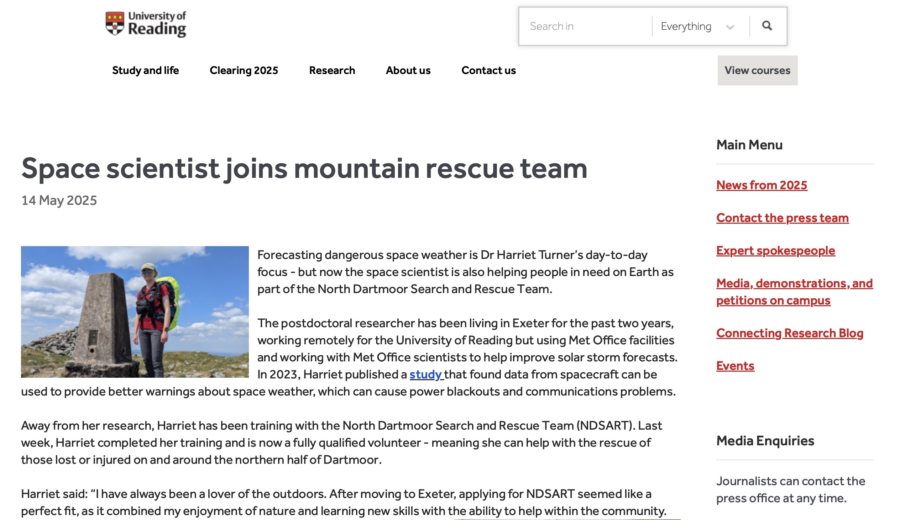

Having spent the past year training with North Dartmoor Search and Rescue Team, I have recently completed my log book and been accepted as a full team member.  

The University of Reading released an article about this, which can be found [here](https://www.reading.ac.uk/news/2025/University-News/Space-scientist-Harriet-Turner-joins-mountain-rescue-team).

