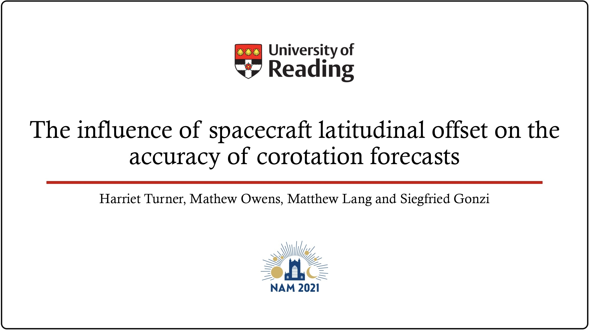

I presented my work online at the National Astronomy Meeting, which was held from 19th to 24th July 2021.

In this talk, I presented the work from my 2021 paper about how spacecraft latitudinal separation affects the accuracy of solar wind corotation forecasts.  

The slides can be found [here](slides/NAM_talk.pdf).

