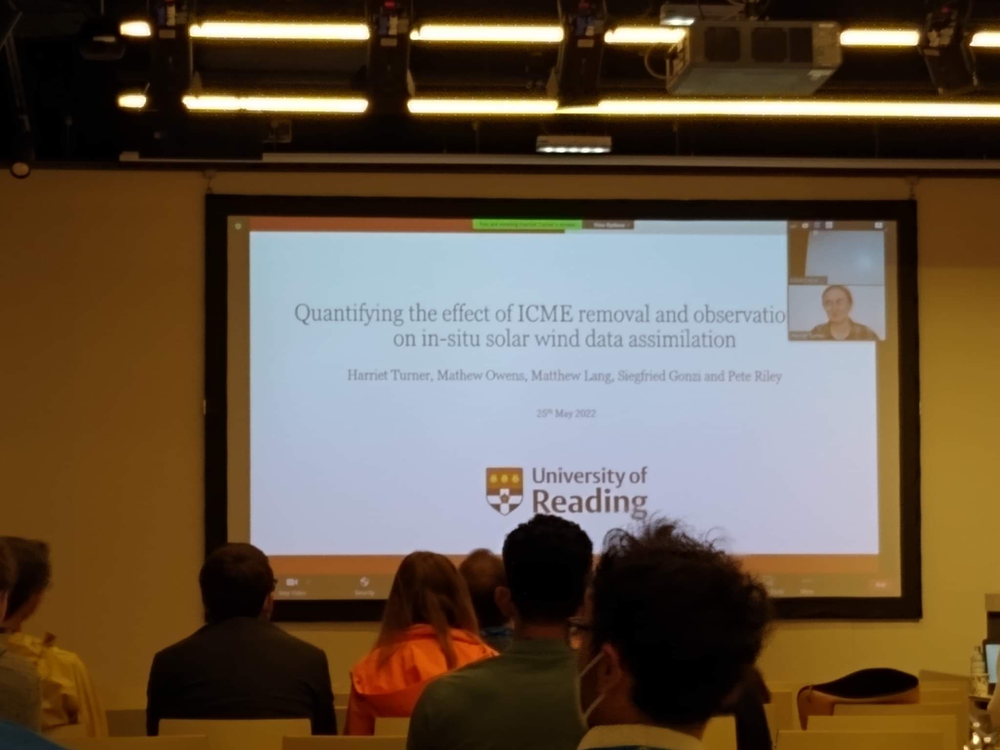

I presented my work online at the EGU General Assembly on 25th May 2022.

In this talk, I presented the work from my 2022 paper about how removing ICMEs and the age of observations affects the forecast accuracy of solar wind data assimilation.  

The slides can be found [here](slides/EGU_talk.pdf).

*The in-person view of my online talk at EGU 2022.*
