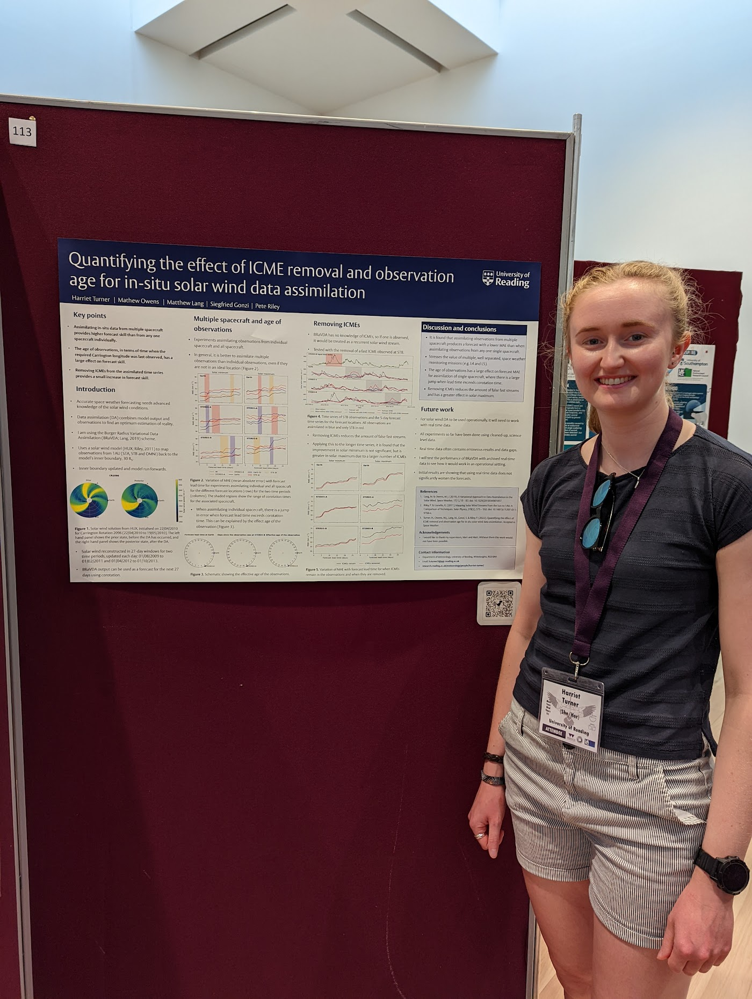

I presented a poster at the National Astronomy Meeting (NAM), which was hosted at the University of Warwick, Coventry from 11th to 15th July, 2022.

My poster presented the work from my 2022 paper, which was also presented virtually at EGU earlier in the year. This work looked at how removing ICMEs and the age of observations affect solar wind data assimilation. 

The full PDF of the poster can be found [here](slides/NAM_poster.pdf).

*Presenting my poster at NAM, 2022.*
