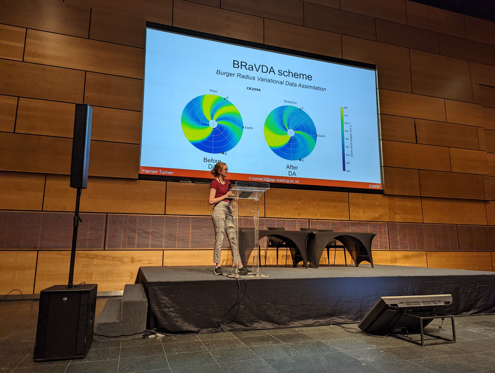

I presented my work at European Space Weather Week, which was held in Zagreb, Croatia from 24th to 28th October, 2022.

In the talk, I presented the work that was leading up to the publication of my third paper. This was comparing the use of near-real-time data in solar wind data assimilation (DA) to the use more pre-processed, science level data. I also showed how an L5 monitor could be a useful asset to solar wind DA.  

The slides can be found [here](slides/ESWW_presentation_2022.pdf).

*Presenting my work at ESWW, 2022.*
