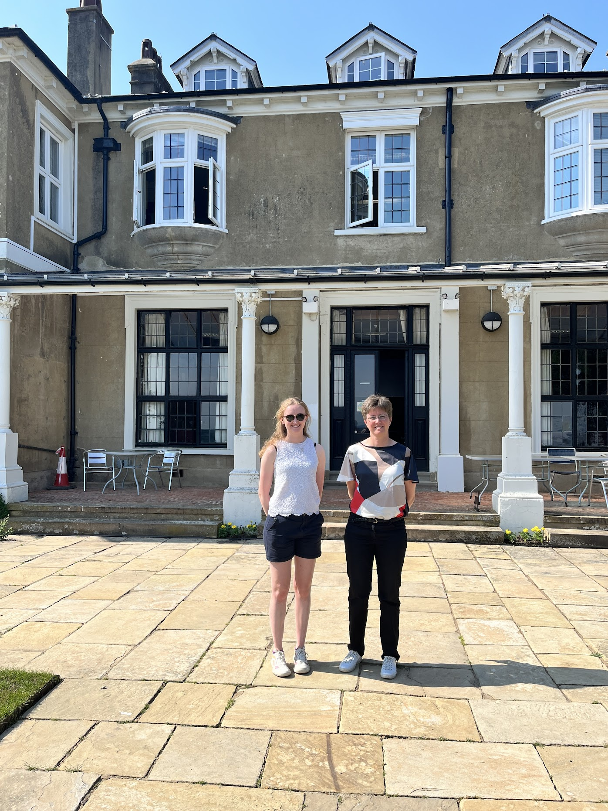

This was an invited seminar at the Mullard Space Science Laboratory (MSSL) to discuss the implications of my work on the ESA Vigil L5 mission. 

I was invited to give a seminar to the group of researchers at MSSL, lasting approximately 40 minutes. During my visit there, I was taken on a tour of the laboratory and grounds and also sat  in on another talk that was given that day. 

My seminar presented the work in my 2023 paper, which investigated the use of near-real-time data in solar wind data assimilation and the forecast improvements that could arise from it when using data from an L5 monitor. This was pertinent to MSSL, as they are constructing the magnetometer for the ESA Vigil mission to L5. 

The slides can be found [here](slides/MSSL_talk.pdf). 

This work was also presented in an online seminar for the Magnetosphere, Ionosphere and Solar Terrestrial (MIST) group on 11/07/2023. The recording of which can be found [here](https://www.youtube.com/watch?v=bxpRCiF9i9Q), and the slides [here](slides/MIST_seminar.pdf).

I also gave a similar version of this talk to the International Association of Geomagnetism and Aeronomy Geospace Data Assimilation Working Group in an online seminar on 03/10/2023. The slides for this talk can be found [here](slides/IADA_talk.pdf). 

*Outside the MSSL building with the other presenter of the day.*
