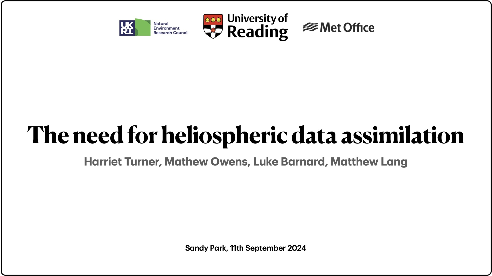

This was an invited talk at the UK Space Weather and Space Environment Meeting, held at Sandy Park, Exeter from 9th to 12th September 2024. 

This meeting was a celebration of 10-years of 24/7 operational space weather forecasting in the UK at the Met Office. My talk was discussing the need for heliospheric data assimilation, explaining how different coronal models can lead to different solar wind states at Earth, despite them all being valid solutions. Heliospheric data assimilation can act to bring these solutions closer together and closer to the observations of the solar wind. 

The slides can be found [here](slides/Data assimilation in the solar wind.pdf). 

