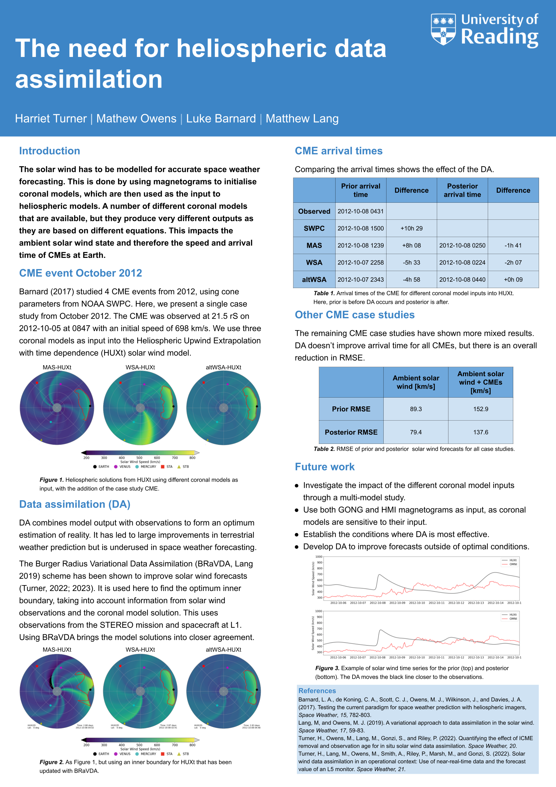

I presented a poster at European Space Weather Week, which was held in Coimbra, Portugal from 4th to 8th November, 2024.

My poster displayed the work presented at the UKSWSE meeting, discussing the need for data assimilation in the heliosphere. It explained how different coronal models can lead to different solar wind states at Earth, despite them all being valid solutions. Heliospheric data assimilation can act to bring these solutions closer together and closer to the observations of the solar wind. 

The poster session was spread over 3 shorter periods, and discussion with other conference attendees was very interesting and provided a lot of insight into the problems at hand. 

The full PDF of the poster can be found [here](slides/ESWW 2024 Poster.pdf).

