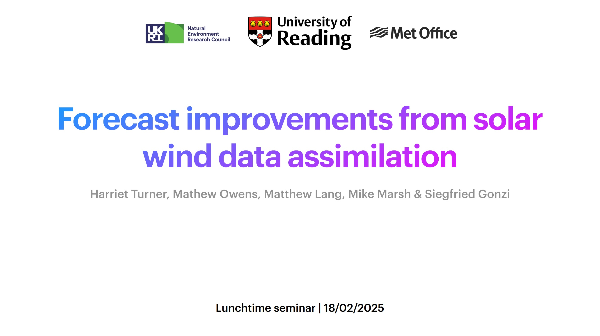

I presented the work from my PhD in a seminar in the Department of Meteorology at the University of Reading on 18th February, 2025.

During the seminar, I covered a large range of introductory material as a large proportion of the audience was not familiar with space weather. I then covered the three papers that I published during my PhD that made up the work chapters of my thesis.  

A PDF of the seminar slides can be found [here](slides/Departmental seminar.pdf).

