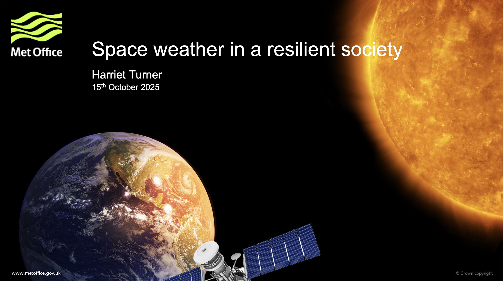

I was invited to talk about space weather in a resilient society at the RAL Space Early Careers Conference on the Harwell Campus on 15th October, 2025.

During the talk I covered some introductory material about what space weather is and what impacts it can cause on modern society. I spoke about the mitigation that can be put in place against these impacts and how we can improve society's resilience to space weather through research, investment in projects and future space missions.

A PDF of the seminar slides can be found [here](slides/Resilient_society_presentation.pdf).

